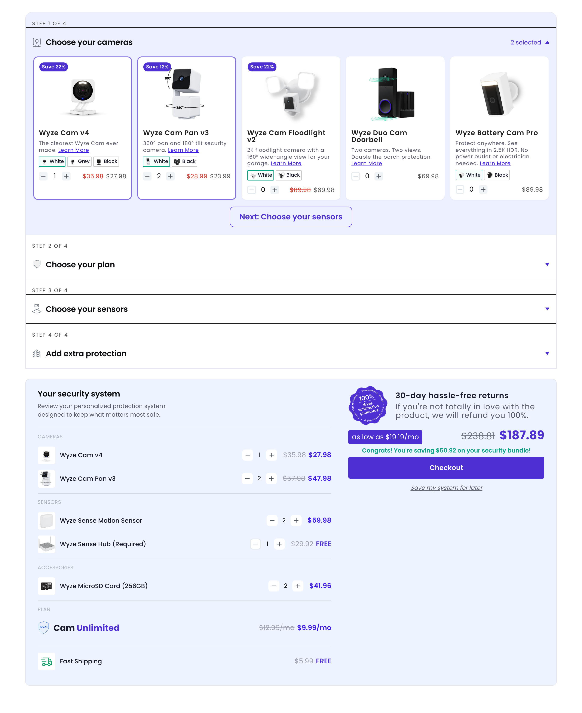
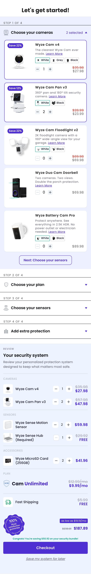

# Wyze Bundle Builder

A multi-step bundle builder with a live review panel. A shopper assembles a
home-security system through a four-step accordion (Cameras → Sensors → Add
extra protection → Plan) while a summary on the right recalculates totals,
savings, and financing in real time. Everything renders from a JSON catalog
served by a small API — nothing is hardcoded per product.




## Quick start

Requires **Node 20+**.

```bash
npm install
npm run dev
```

`npm run dev` starts **both** the Vite dev server and the API together (via
`concurrently`). Vite prints the local URL (e.g. http://localhost:5173); the
API runs on `http://localhost:8787` and Vite proxies `/api/*` to it.

> Builds and runs from a clean clone with just `npm install && npm run dev`.

### Production

```bash
npm run build     # type-check + bundle the app into dist/
npm start         # Express serves dist/ AND the API on one port (8787)
```

### Scripts

| Script | What it does |
| --- | --- |
| `npm run dev` | Vite + API together (development) |
| `npm run dev:web` / `npm run dev:api` | Run either half on its own |
| `npm run build` | `tsc -b` type-check + production build to `dist/` |
| `npm start` | Production server (API + static `dist/`) |
| `npm test` | Vitest unit + render tests |
| `npm run test:watch` | Vitest in watch mode |
| `npm run lint` | ESLint |

> Note: `npm run preview` serves only the static build, so the catalog API
> won't be there. Use `npm run dev` (development) or `npm start` (production).

## Data & API (the bonus)

The app is **fully data-driven** from [`src/data/catalog.json`](src/data/catalog.json) —
steps, products, variants, seeded quantities, pricing, and the financing
divisor all live there.

- A small **Express** API ([`server/index.js`](server/index.js)) serves it at
  `GET /api/catalog` (in-memory cached), plus `GET /api/health`. In production
  the same server also serves the built front end.
- The client fetches it with **React Query** (loading / error / retry handled
  by the query) and **validates the response with zod** at the boundary — the
  zod schema in [`src/types`](src/types/index.ts) is the single source of truth,
  and all TypeScript types are inferred from it.
- The initial state is **seeded from the catalog**, so the app loads looking
  exactly like the design — including the review panel's pre-populated sensors,
  accessory, and plan that have no add-control in that view.

## Architecture

```
src/
  app/          App shell, entry, error boundary, global CSS
  api/          React Query client + useCatalog() hook
  features/     Feature views — builder/ and review/
  components/   Shared UI — Price, QuantityStepper, ProductThumb, icons …
  state/        Cart reducer + context (pure logic)
  lib/          money, persistence
  types/        zod schemas + inferred types
  styles/       design tokens (alias to the Tailwind @theme)
  data/         catalog.json
server/         Express API
```

A few deliberate choices:

- **Pure cart logic.** The reducer and selectors take the `catalog` as an
  argument (`createCartReducer(catalog)`, `reviewLines(catalog, state)`, …)
  rather than reading a global. The catalog flows through React context, which
  keeps the logic trivially unit-testable.
- **Per-variant quantities.** Each color variant tracks its own count; the card
  stepper is bound to the active variant, and every variant with qty > 0 shows
  as its own review line. Products without colors just get a single stepper.
- **Design tokens in one place.** Colors, radii, shadows, the font, and a custom
  `split:` breakpoint live in a Tailwind v4 `@theme` block; the CSS Modules
  alias those vars, so a value changes in exactly one spot.
- **`@/` path alias** for clean imports across the layered folders.
- **Persistence** via `localStorage` behind "Save my system for later".

## Testing

```bash
npm test
```

Vitest + Testing Library cover the pure logic (reducer transitions, clamping,
immutability, totals, selectors, the per-variant behavior) and a render /
interaction test that drives the reducer through a real click.

## Tech stack

React 19 · TypeScript · Vite · React Query · zod · Tailwind v4 (utilities) +
CSS Modules · Express · Vitest + Testing Library.

## Decisions, tradeoffs & notes

- **Styling is a hybrid.** Layout/responsive behavior is Tailwind utility
  classes; component-level styling is CSS Modules. Tailwind is imported
  utilities-only (no preflight) so it coexists with the existing styles instead
  of resetting them — two systems, but each used where it's strongest.
- **Font.** The design specs call for *Gilroy* (a paid font). I applied every
  numeric spec (size / weight / line-height / spacing) but kept **Poppins** as
  the family, since Gilroy isn't freely redistributable. Dropping the Gilroy
  files in and adding `@font-face` is the only step to make it pixel-exact.
- **Backend scope.** The API serves a single catalog file (cached) — no
  database or auth, which suits the task. Checkout and "Save for later" are
  demo actions (the latter persists to `localStorage`).
- **Responsive.** Three layouts — stacked (mobile), builder-plus-sidebar
  (medium, ≥1140px), and a wide layout where the cameras sit in one row with the
  review full-width below (≥1280px).

### What I'd do next

- Swap in Gilroy once licensed.
- More tests (additional component coverage, an end-to-end happy path).
- A deeper accessibility pass (focus management, announcements).
